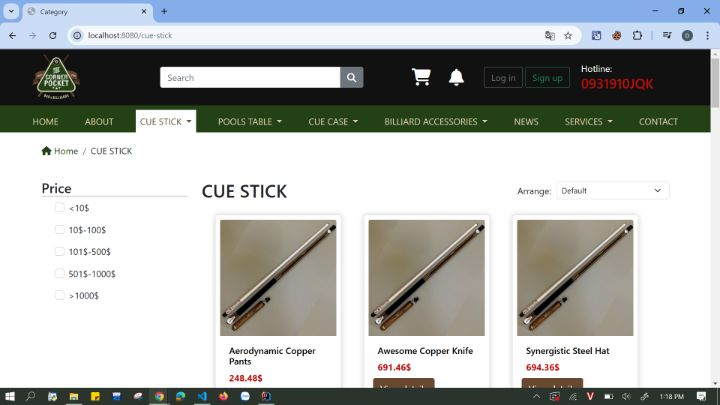
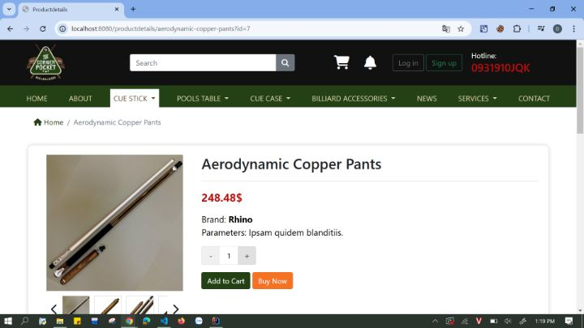
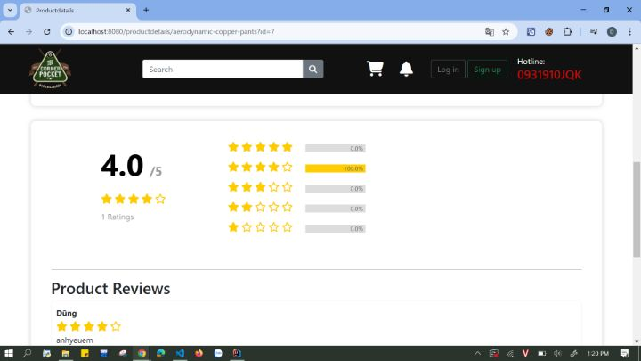
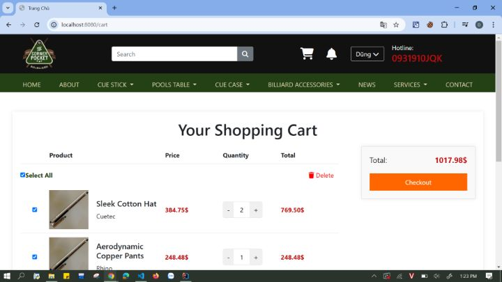
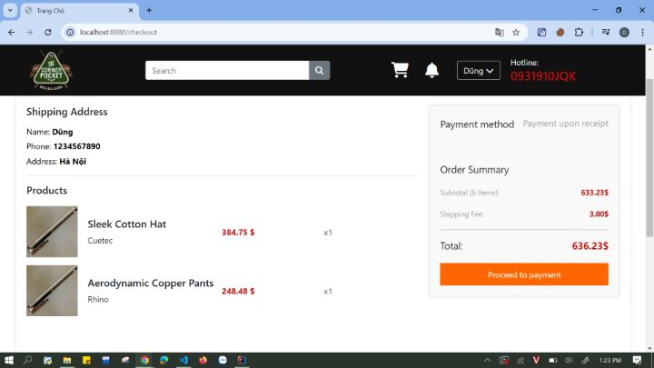
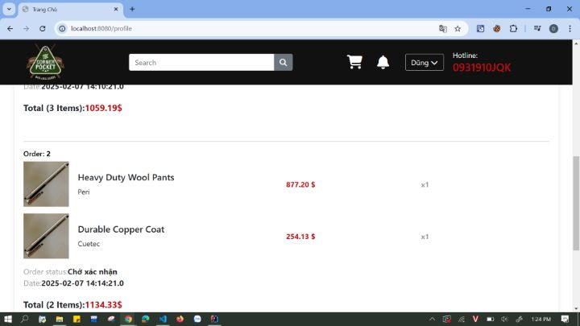

# Chào mừng bạn đã đến với dự án Web Billiards Shop

## Cách setup

#### Yêu cầu hệ thống

- Java 17+

- mySQL

- maven
#### Cấu hình database

Tạo database trong MySQL:
```
CREATE DATABASE billiardsshop;
```


## Demo











## Các chức năng
- **Quản lý sản phẩm**: Danh mục bàn bi-a, cơ, bi, găng tay, phụ kiện,...
- **Giỏ hàng & Thanh toán**: Thêm/xóa sản phẩm, tính tổng tiền, đặt hàng.
- **Quản lý đơn hàng**: Xem lịch sử mua hàng, theo dõi tình trạng đơn hàng.
- **Hệ thống tài khoản**: Đăng ký, đăng nhập, quản lý thông tin cá nhân.
- **Tìm kiếm & Bộ lọc**: Tìm sản phẩm theo danh mục, giá, thương hiệu,...

## Phản hồi và hỗ trợ 📬

Chúng tôi rất mong nhận được phản hồi từ bạn! Nếu bạn có bất kỳ ý kiến, đề xuất hoặc cần hỗ trợ, vui lòng liên hệ với chúng tôi tại [dung242723@gmail.com].


